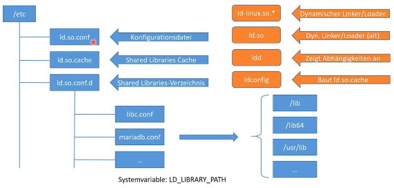

### Programme im Vordergrund und im Hintergrund ausführen und verwalten
  * Programme sperren normalerweise das Terminal, von dem aus sie aufgerufen wurden.
  * Programme können mit Ctrl+C beendet werden.
  * Programme können mit & im Hintergrund gestartet werden, sodass das Terminal weiter nutzbar bleibt.
  * Jobs können mit fg und bg in den Vordergrund und zurück geschoben werden.
  * Wird die Shell beendet, werden auch alle in dieser Shell gestarteten Programme beendet.
  * Mit nohup < Prozess > kann ein Prozdess so gestartet werden, dass er das HUP-Signal ignoriert, wenn die Shell beendet wird. Seine Ausgaben werden in nohup.out geschrieben.
  * Mit disown %< BG-ID > kann ein Prozess nachträglich von der Shell getrennt werden.

### Prozesse beenden
  * Jeder Prozess hat seine eigene Prozess-ID kruz "PID". Diese wird vom System automatisch vergeben, wir haben keinen Einfluss darauf.
  * Mit killall < Zeichenkette > können alle Prozesse beendet werden, die der Zeichenkette entsprechen.
  
### Prozess-Prioritäten mit Nice-Levels steuern
  * Jedem Prozess vom Linux-System bzw. der CPU ein bestimmter Grad an Aufmerksamkeit zugestanden
  * Dieser Grad wird durch das Nice-Level bestimmt, Standard ist 0
  * Die Priorität liegt zwischen -20(höchste) und +19(niedrigste)
  * Prioritäten können mit dem Programm nice beim Start des Programms gesetzt werden
  * Nur root darf Nice-Level heruntersetzten, Programme also höher priorisieren
  * Ein Programm mit Nice-Level -20 kann das System beeinträchtigen, dies sollte nur sehr vorsichtig eingesetzt werden.
  * Mit renice können die Prioritäten eines laufenden Prozesses angepasst werden.
  * Nice-Levels sind keine Booster-Funktion und können nur als eines von mehreren Tuning-Mitteln gesehen werden.

### Einführung in Shared Libraries

  * Shared Libraries (Programmbibliotheken) sind Routine-Funktionen, die immer wieder benötigt werden und von verschiedenen Programmen auf dem System genutzt werden können.
  * Vorteil: Es müssen nicht immer alle Funktionen in jedes Programm einkompiliert werden.
  * Nachteil: Die Shared Libraries müssen zur Verfügung stehen, sonst läuft das Programm nicht (Abhängigkeiten).
  * Es existieren diverse Phade und Programme für die Verwaltunng von Shared Libraries

### Shared Libraries in der Praxis
  * **/etc/ld.so.conf/** ist die Hauptkonfigurationsdatei für die Verwaltung der Programmbibliotheken.
  * unter **/etc/ld.so.conf.d/** können Dateien mit Pfaden zu Shared Libraries hinterlegt werden.
  * **/etc/ld.so.cache** enthält die Pfade aller bekannten Shared Libraries in binärer Form.
  * Pfade zu Bibliotheken können auch über die Systemvariable $LD_LIBRARIY_PATH gesetzt werden, ihre Syntax ist analog zur Variable PATH
  * mit ldd < Programmpdad > können die Shared Libraries, von denen ein Programm abhängig ist, angezeigt werden.
  * Mit ldconfig kann der Cache erstellt werden und neue Libraries registriert werden.

### Nützliche Befehle im Bezug auf Prozessverwatlung und Shared-Libraries
  * `kill` - Einem Prozess Signale senden
    * `kill -l` - zeigt alle möglichen Signale
    * SIGTERM oder 15 ist das Basissignal und beendet den Prozess
    * SIGKILL oder 9 forced die beendung eines Prozesses
    * SIGINT oder 2 ist das gleiche wie Ctrl+C und SIGTERM sehr ähnlich.
    * SIGSTOP 19 ist das gleiche wie Ctrl+Z und hält den Prozess an, aber beendet ihn nicht.
    * SIGHUP 1 ist das Signal, dass bei der beendigung des Terminals aus dem der betreffende Prozess aufgerufen wurde gesendet wird. Ähnlich wie SIGTERM oder SIGINT.
  * `nice` - Weisst einem Programm einen Nice-Wert zu.
  * `renice` - Ändert den vorhandenen Nice-Wert eines Programms.
  * `ldconfig` - Erstellt den Inhalt von **/etc/ld.so.chache/**
    * `ldconfig -p` - Zeigt die Shared Libraries und deren Pfade
    * `ldconfig -p | grep < Bibliothek >` - Zeigt die ausgewählte Bibliothek
  * `ldd` - Zeigt die Abhängigkeit eines Programms