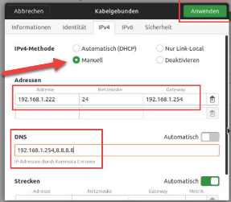

### Grundlegende Netzwerkeinstellungen abfragen
  * Die Netzwerkkonfiguration kann sowohl über die GUI via NetworkManager als auch in der Kommandozeile vorgenommen werden
  * Der NetworkManager wurde zunächst für WLAN-Umgebungen konzipiert, unterstützt mittlerweile abber alle Arten von Netzwerken
  * Im Paket iproute2 wird insbesondere das Programm ip mitgeliefert, das für alle Aspekte der IP-Konfiguration genutzt werden kann
  * Jedes Linux-System hat eine Loopback-Schnittstelle (lo, 127.0.0.1/8 bzw. ::1/128), die zur systeminternen Kommunikation genutzt wird.
  * Mit dem Tool ss lassen sich Kommunikationsverbindungen und Portbindungen anzeigen
  * Die älteren Tools, wie ifconfig, netstat u.a. befinden sich im Paket net-tools, das mittlerweile oft separat installiert werden muss.
  * **/etc/resolv.conf** enthält traditionell die Namenserver-Einträge (DNS)
  * Mittlerweile übernimmt das der Dienst systemd-resolved
  * Der NetworkManager hat auch ein CLI-Frontend namens nm-cli

### Grundlegende Netzwerk-Konfiguration mit dem NetworkManager
  * Mit Hilfe der GUI geschieht die Konfiguration über die LAN-Einstellung und das dortige IPv4-Register
  * Dort finden wir die IPv4-Konfigurationsmethode, das Eingabefeld einer statischen IP-Adresse mit zugehöriger Netzmaske ud das Default-Gateway
  * Zudem kann hier ein DNS-Server angegeben werden  
  
  * Änderungen werden hier erst nach einer Re-Initialisierung wirksam, daher das Interface deaktivieren und danach wieder aktivieren
  * Auch die IPv6-Konfiguration kann über die GUI vorgenommen werden.

### Grundlegende IP-Konfiguration auf der Kommandozeile
  * Konfiguration auf der Kommandozeile ist distributionsabhängig
  * Ubuntu und andere Debian-Derivate:
    *  Datei **/etc/network/interfaces**
       *  Hier wurden früher die Interface-Parameter festgelegt. Heute in der Regel nnur nochh für das Loopback-Interface zuständig, da die anderen Interfaces vom Network-Manager verwaltet werden.
     * Datei **/etc/resolv.conf**
       * Hier können DNS-Server eingetragen werden
     * Verzeichnis **/etc/netplan**
       * Metaebene für die Netzwerk-Konfiguration namens netplan
     * Datei **01-network-manager-all.yaml** im Verzeichnis **/etc/netplan**
       * In dieser Konfigurations-Datei steht, wer das Netzwerk verwaltet (i.d.R NetworkManager)
     * Sollte die IP-Konfiguration auf der Kommandozeile angepasst werden, kann dies mit dem Tool nmcli durchgeführt werden. Die hier vorgenommenen Änderungen bleiben auch nach einem Neustart erhalten
   * CentOS
     * Setzt ab Version 7 auf den NetworkManager und das Tool `nmcli`
     * Verzeichnis **/etc/sysconfig/network-scripts** Hier befinden sich traditionell die Konfigurationsdateien für die vorhanden Schnittstellen
     * Sollte die  IP-Konfiguration auf der Kommandozeile angepasst werden, kannn dies mit dem Tool nmcli durchgeführt werden. Diese Änderungen bleiben auch nach einem Neustart erhalten (analog zu Debian-Derivaten)

### DNS mit dig & Co. testen
  * Linux implementiert mit dem Nameservice-Switch, kurz: `nsswitch`, ein Konzept, das die grundätzliche Auflösung von Namen in numerische Werte regelt
    * Konfigurationsdatei **/etc/nsswitch.conf**
  * Es gibt verschiedene Komponenten, wie passwd, group, shadow, hosts oder protocols, die eine Auflösung in numerische Werte benötigen
  * Für die BBenutzerverwaltung mittels passwd, group, etc. werden zunächst die entsprechenden Dateien zurate gezogen, also z.B. **/etc/passwd**, **/etc/group** oder **/etc/shadow**
  * Wenn dort keine Auflösung erfolgen kann, wird ggf. ein systemd-Mechanismus gefragt. Wie dieser angesprochen wird, regeln Shared Libraries
  * Bei Host-Namen wird zunächst die Datei **/etc/hosts** abgefragt
  * Die Hosts-Datei wird in der Regel immer vor dem DNS-Mechanismus befragt, daher können hier gezielt Einträge vorgenommen werden, deren Namensauflösung frei wählbar sind
  * Danach kommt mdns4_minimal, mDNS steht für Multicast DNS und ist ein spezieller, neuerer Dienst, der versucht, DNS-Namen per Multicast im lokalen Netz aufzulösen
  * Der Befehlt `getent` steht für Get Entity und ermöglicht das gezielte Auslesen eines Eintrags aus einer der administrativen Datenbankdateien, wie z.B. passwd, hosts, etc.
  * Das Tool `nslookup`ist ein DNS-Clientprogramm. Es hat einen interaktiven Modus und kann DNS-Anfragen absetzen.
  * Das Tool host löst ebenfalls den  Namen in IPv4- und IPv6-Adressen auf
  * Mit host -t können wir den Abfragetyp ändern und nach Mailserver (mx) oder dem Nameserver (ns) fragen
  * Die Ausgabe von dig enthält viele, zunächst kryptisch anmutende, Informationen und Werte. Diese entsprechen jedoch ziemlich genau den Datenfeldern der DNS-Pakete, die über das Netzwer gehen, daher ist dig das leistungsstärkste Toll für DNS-Abfragen
  * dig fragt per Default nur nach A-Einträgen, nicht nach AAAA
  * dig nimmt nicht automatisch eine Reverse-Auflösung vor, dazu muss die Option -x gesetzt werden, z.B.: dig @192.168.1.254 -x 8.8.8.8

### Den Hostname festlegen
  * Der Hostname wird in verschiedenen Situationen verwendet und dient zur Identifikation des Hosts lokal und Netzwerk 
  * Der Hostname wird im Prompt angezeigt und kann auf verschiedene Wege ausgegeben werden: z.B. `uname -n` oder `hostname`
  * Der Hostname wird in der Datei **/etc/hostname** hinterlegt, der Befehl hostname greift hierauf zu
  * Mit `hostname -f`kann der FQDN des Systems, also der vollständige Hostnamen mit Domain undd Toplevel-Domain angezeigt werdenn
  * Mit `systemctl set-hostname "Name"` kann der Hostname konfiguriert werden, es gibt mittlerweile verschiedene Varianten:
    * Beim *Pretty Hostname* handelt es sich um eine erweiterte Form des Hostnames, wenn sonst eigentlich nicht erlaubte Zeichen verwendet werden
    * Der *Static Hostname* entfernt alle Sonderzeichen
    * Der *Transient Hostname* kann z.B. entstehen, wenn über eine dynamische Konfiguration ein Hostname übermittelt wird. Sobald ein statischer Hostname gesettzt ist, wird dieser jedoch bevorzugt
  * Der eigene Hostname wird zu Identifikation verwendet
  * Auch wenn ein Eintrag in der Datei **/etc/hosts** erzeugt wurde, können andere Systeme im Netzwerk diesen Namen deswegen noch nicht auflösen. Dazu bedarf es z.B. DNS, wobei der Name unseres Systems dann in der Zonendatei des DNS-Servers als A oder AAAA-Eintrag vorhanden sein muss

### Statische Routen
  * Statische Routen werden auf Clients nur in Ausnahmefällen benötigt, eher in Server-Netzwerken und auf Routern erforderlich
  * Statische Routen werden notwendig für Subnetzte, die nicht über das Default-Gateway erreicht werden können
  * Ein Routingeintrag bzw. eine Route beginnt mit dem Routing-Ziel und der Adresse des Routers, also des Gateways über das der Traffic geleitet werden soll
  * Als normaler User dürfen keine Routen gesetzt werden 
  * Der Befehl `ip r` zeigt die vorhanden Routen
  * Beispiel: Der Befehl `route add -net 172.16.20.128 netmask 255.255.255.128 gw 192.168.1.1` fügt eine entsprechende Route dazu. Das ausgehende Interface wird automatisch hinzugefügt.
  * Beispiel: der Befehl `ip route add 172.16.20.128/25 via 192.168.1.1 dev enp0s3 dient äquivalent dazu
  * Nach dem Neustart sind diese statishen Routen nicht mehr vorhanden
  * Traditionell können entsprechende Skripts unter **/etc/network** bei Debian-Derivaten und **/etc/systemconfig/network-scripts** bei Red Hat-Derivaten hinterlegt werden, die bei systemstart die statischen Routen einrichten
  * Heutzutage wird dies i.d.R. mit systemd undd nmcli erledigt:
    * In der GUI über das Dialogfenster "Strecken" (holprige Übersetzung für Routen)
    * Auf der Kommandozeile mit `nmcli`durch den Befehl `set ipv4.routes 10.10.10.0/24 192.168.1.1`

### Netzwerk troubleshooting
  * Systematische Prüfung der eigenen IP-Konfiguration (Adresse und Subnetzmaske), Erreichbarkeit des Gatewas, die Einstellung der Default-Route und die Routing-Tabelle führen meist zu einer ersten guten Diagnose
  * Eines der wichtigsten Tools ist `ping`. Es prüft die grundsätzliche Netzwerk-Konnektivität mit dem Ziel
  * Bei ping wird IPv6 immer bevorzugt, wenn eine entsprechende IPv6-Adresse zurückgeliefert wird (wenn ein Hostname als Ziel angegeben wird)
  * ping hat noch viele  andere Optionen und Parameter
  * Wird nur `ping` eingegeben, erscheint eine Kurzhilfe
  * Ein weiterer wichtiger Befehl ist `traceroute`. Er muss ggf. dediziert nach nach installiert werden mit `apt install inetutils-traceroute` bzw `yum install traceroute`
  * Mit traceroute können wir eine Routenverfolgung durchführen, die jeden Hop, also Router, auf dem Weg zum ziel darstellt
  * Der Parameter `--resolve-hostnames` löst die Hostnames dabei auf
  * Durch `traceroute` können z.B. Routing-Schleifen entdeckt werden
  * Es kann wohol bei `ping`als auch bei `traceroute` dazu kommen, dass Systeme nicht antworten, weil sie eine aktive Firewall haben, die eine Antwort verhindert.
  * Auch Netzwerk-Firewalls oder entsprechend konfigurerirte Router im Pfad blockeren häufig entsprechende Pakete
  * Ob ein System im selben Subnetz aktiv ist und ggf. aufgrund einer Firewall nicht mit uns kommuniieren will, können wir ermitteln, indem wir nach dem Verbindungsversuch den ARP-Cache für IPv4 bzw. den Neighbor-Cache für IPv6 checken: `ip neigh` oder `ip n`
  * Ein ähnliches Tool wie `traceroute` ist `tracepath`, es zeigt einige weiter statistische Informationen an, unter anderem die sogenannte Path MTU, kurz: PMTU

### Nützliche Befehle
  * `ip address show` - Zeigt die derzeitige IP-Adresskonfiguration an
  * `ip a` - Wie ip address show, da Angaben gekürzt werden können und show die Default-Action ist
  * `ip link show` - Zeigt die Interfaces des Systems an
  * `ip -s address show` - Zeigt die Interface-Statistiken an
  * `ip route show` bzw `ip r` - Zeigt die IPv4-Routing-Tabelle
  * `ip -6 address show` - Zeigt die IPv6-Adressen an
  * `ip -6 route show` - Zeigt die IPv6-Routingtabelle an
  * `ip neigh show` - Zeigt den IPv4-ARP-Cache und den IPv6-Neighbor Cache an
  * `ss -t` - Zeigt alle aktiven TCP-Verbindungen 
  * `ss -tl` - Zeigt alle vom Serverdienst gebundenen TCP-Ports an
  * `ss -tln` - Zeigt die gebundenen Ports numerisch an
  * `(sudo) ss -tlpn` - Zeigt zu den gebundenen, numerischen Ports die Prozesse an
  * `ifconfig` - Zeigt die aktiven Schnittstellen undd deren IP-Adressen an
  * `ifconfig enp0s3` - Zeigt nur die angegebene Schnittstelle an
  * `ifconfig -a` - Zeigt alle Schnittstellen, auch die inaktiven an
  * `arp -a` - Zeigt den ARP-Cache (IPv4)
  * `arp -an` - Zeigt den Cache ohne Namensauflösung an
  * `route` - Zeigt die Routing-Tabelle für IPv4
  * `route -n` - Zeigt die Tabelle numerisch an
  * `route -6n` - Zeigt die Routing-Tabelle für IPv6 numerisch an
  * `netstat -nr` - Wie `route -n`
  * `netstat -6nr` - Wie `route -6n`
  * `netstat -tn` - Zeigt alle aktiven TCP-Sessions numerisch an
  * `(sudo) netstat -tlpn` - Zeigt alle gebundenen Ports mit ihren Prozessen an
  * `(sudo) netstat -tulpn` - Wie oben nur zusätzlich UDP-Ports
  * `nmcli` - Zeigt die IP-Konfirutation umfassend zusammengefasst an
  * `nmcli dev show` - Zeigt die Konfiguration zu den Schnittstellen an
  * `nmcli connection edit <Schnittstelle>` - Öffnet IP-Konfiguration des NetworkManager auf CLI-Ebene
  * `nmcli connection up <Schnittstelle>` - Aktiviert das angegebene Interface (NetworkManager)
  * `nmcli connection down <Schnittstelle>` - Deaktiviert das angegebene Interface (NetworkManager)
  * `ifup eth0` - Aktiviert das angegebene Interface (Interfaces-Datei)
  * `ifdown eth0` - Deaktiviert das angegebene Interface (NetworkManager)
  * `nmcli connection modify ipv4.<Tab>` - Zeigt die IPv4-Kofnigurationsmöglichkeiten unter CentOS
  * `getent` - Zeigt bestimmten Eintrag aus System-Datenbankdatei
  * `nslookop` - Startet interaktiven DNS-Client zur Prüfung der Auflösung
  * `host hostname` - Löst Namen mittels Befehl **host** in IP-Adresse auf
  * `host -t mx Domainname` - Zeigt Mailserer der angegebenen Domain
  * `host -t ns Domainname` - Zeigt Nameserver der angegebenen Domain
  * `dig hostname` - Zeigt umfangreiche DNS-Informationen
  * `dig @8.8.8.8 google.de ns` - Sucht nach dem Nameserver-Einträgen (ns) für die Domain google.de undd fragt dabei den DNS-Server 8.8.8.8
  * `dig @192.168.1.254 -x 8.8.8.8` - Reverse-Namensauflösung (-x) durch DNS-Server 192.168.1.254 für IP-Adresse 8.8.8.8
  * `uname` - Dient zur Anzeige von Systeminformationen
  * `uname -n` - Zeigt Hostname des Systems an
  * `hostname` - Liest Hostname aus **/etc/hostname** und zeigt diesen an
  * `hostname -f` - Zeigt FQDN des Systems an
  * `hostnamectl` - Zeigt dieverse Informationen rund um die System-Bezeichnung
  * `systemctl set-hostname "Name"` - Konfiguriert den Hostnamen des Systems
  * `route add` - Konfiguriert eine neue Route
  * `ip route add` - Konfiguriert eine neue Route
  * `ping` - Prüft die Erreichbarkeit eines Systems
  * `traceroute <Zieladresse>` - Zeigt jeden Hop auf dem Weg zum Zielsystem
  * `traceroute --resolve-hostnames <Ziel>` - Zeigt jeden Hop auf den Weg zum Zielsystem mit Hostnames
  * `tracepath <Zieladresse>` - Zeigt den Weg zum Zielsystem mit Zusatzinformationen
  * `ip neigh` - Zeigt ARP-Cache